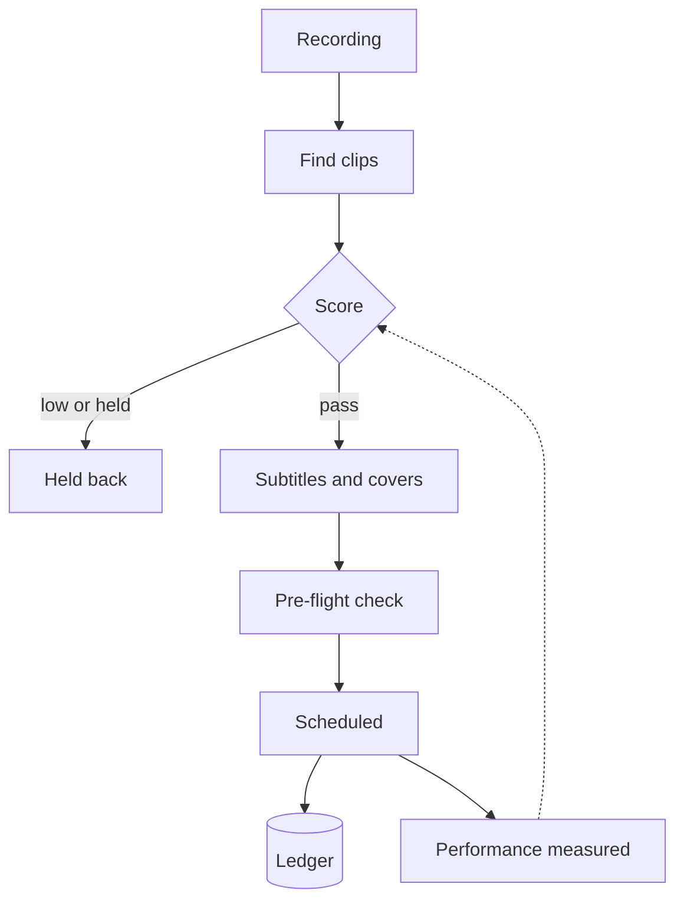

<b>Recorded sessions in; scored, subtitled, scheduled short videos out</b>

من تسجيلات الجلسات إلى مقاطع قصيرة ثنائية اللغة

<b>Status:</b> In weekly use &nbsp;·&nbsp; <b>Built by</b> <a href="https://github.com/Mohanad1st">Mohannad Hesham</a>

> This is a case study. The source is private because it runs on my own accounts and holds unpublished client material.

## Why I built it

I record training sessions and talks. Cutting each one into clips, subtitling them in two languages and posting on a schedule to four platforms is slow, and it's easy to lose track of what was actually published and what was only planned. This pipeline judges, indexes, schedules and publishes, so a library of recordings becomes a steady, tracked stream of short posts.

## What it does

- Scores each clip on usefulness, credibility, relevance, originality and fit, and holds anything below a quality floor.
- Burns in English and Arabic subtitles and makes cover art for each platform.
- Builds a rolling publishing calendar across LinkedIn, Instagram, TikTok and YouTube.
- A pre-flight check blocks scheduling into a channel that can't actually publish.
- Pulls performance back in, to check the scores and posting times.

## How it works

Screens aren&#x27;t shown because the operator dashboard lists unpublished client material.

## What it's built on

Python · ffmpeg · local speech-to-text · image compositing · a social scheduling service · runs on my machine, not as a hosted service

## Safeguards

- I approve the first real post to any platform, and live scheduling needs a typed confirmation.
- A hand-kept publish ledger separates planned from actually published.
- A manual hold always outranks a score.
- A human visual review comes before any screen-recorded material ships.

## What's not solved yet

- The Arabic subtitles are AI-drafted, and none has been reviewed by a native speaker yet.

## What it doesn't do

- It doesn't decide what's appropriate to show on screen. That stays a human check.

## More from Impact Anchor

- [Impact Anchor: consulting site](https://github.com/Mohanad1st/impact-anchor-site-showcase) — From AI overwhelm to a working adoption plan, for mission-driven teams
- [AI Governance Roadmap](https://github.com/Mohanad1st/ai-governance-roadmap-showcase) — A free course that takes you from first definitions to a working AI governance plan
- [Anchor Learning Hub](https://github.com/Mohanad1st/anchor-learning-hub-showcase) — Interactive, bilingual, offline-ready learning for workshops and training programmes
- [Network Intelligence](https://github.com/Mohanad1st/network-intelligence-showcase) — Relationships, opportunities and content in one self-hosted workspace

---

© 2026 Mohannad Hesham. Showcase text and images only — no source code is published or licensed here. See all my work on <a href="https://github.com/Mohanad1st">my GitHub profile</a> · <a href="https://www.linkedin.com/in/mohannadhesham/">LinkedIn</a>.
