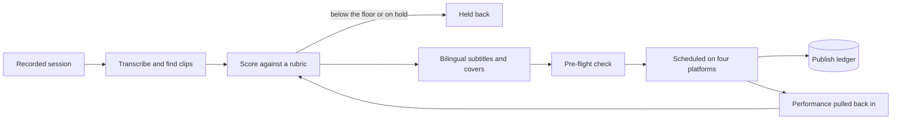

<b>Status:</b> In weekly use &nbsp;·&nbsp; <b>Built by</b> <a href="https://github.com/Mohanad1st">Mohannad Hesham</a> &nbsp;·&nbsp; <b>Source:</b> private

من تسجيلات الجلسات إلى مقاطع قصيرة ثنائية اللغة

> **This is a showcase, not the code.** The source is private because it runs on my own accounts and data. This page shows what it does and how it was built, not the code itself. A live walkthrough is available on request.

## The problem

I record a lot of training sessions and talks. Cutting each one into clips, subtitling them in two languages and posting on a schedule across four platforms is slow, and it's easy to lose track of what was actually published versus merely planned. This pipeline does the judging, indexing, scheduling and publishing, so a library of recordings becomes a steady, tracked stream of short posts.

## What it does

- Scores each candidate clip on usefulness, credibility, relevance, originality and fit, and holds anything below a quality floor
- Burns in English and Arabic subtitles and makes cover art for each platform
- Builds a rolling publishing calendar across LinkedIn, Instagram, TikTok and YouTube
- A pre-flight check that blocks scheduling into a channel that can't actually publish
- Pulls performance back in to learn which times and themes work

## See it

How the work flows:

Screens are not shown because the operator dashboard lists unpublished client material.

## Built with

Python · ffmpeg · local speech-to-text · image compositing · a social scheduling service · runs locally, not as a hosted service

## Built responsibly

- A person approves the first real post to any platform, and live scheduling needs a typed confirmation
- A hand-kept publish ledger separates planned from actually published
- A manual hold always outranks a score
- A human visual review is required before any screen-recorded material ships

## What it deliberately doesn't do

- It does not decide what is appropriate to show on screen. That stays a human check.

## More from Impact Anchor

- [Impact Anchor — consulting site](https://github.com/Mohanad1st/impact-anchor-site-showcase) — From AI overwhelm to a working adoption plan, for mission-driven teams
- [AI Governance Roadmap](https://github.com/Mohanad1st/ai-governance-roadmap-showcase) — A free, bilingual course that takes you from first definitions to a governance plan
- [Anchor Learning Hub](https://github.com/Mohanad1st/anchor-learning-hub-showcase) — Interactive, bilingual, offline-ready learning for workshops and training programmes
- [Network Intelligence](https://github.com/Mohanad1st/network-intelligence-showcase) — Relationships, opportunities and content in one self-hosted workspace

---

© 2026 Mohannad Hesham. Showcase text and images only — no source code is published or licensed here. See all my work on <a href="https://github.com/Mohanad1st">my GitHub profile</a> · <a href="https://www.linkedin.com/in/mohannadhesham/">LinkedIn</a>.
